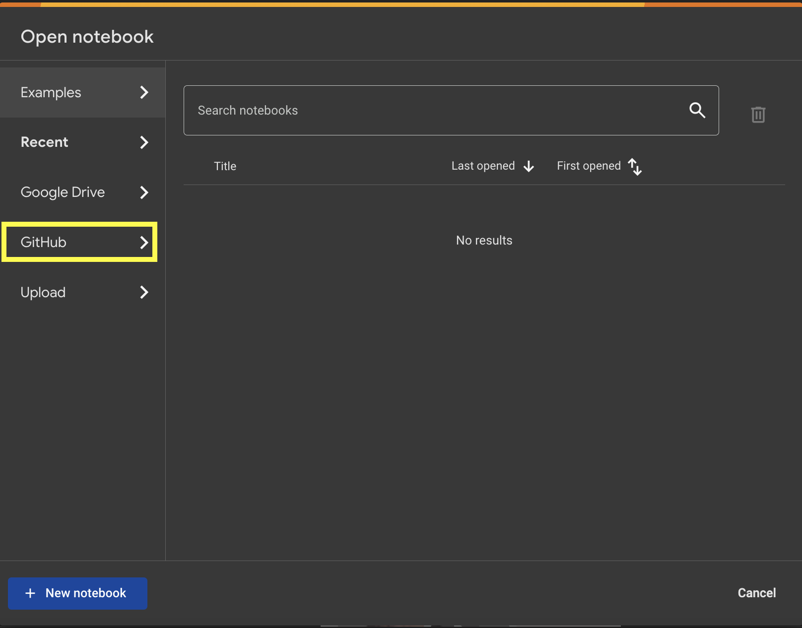
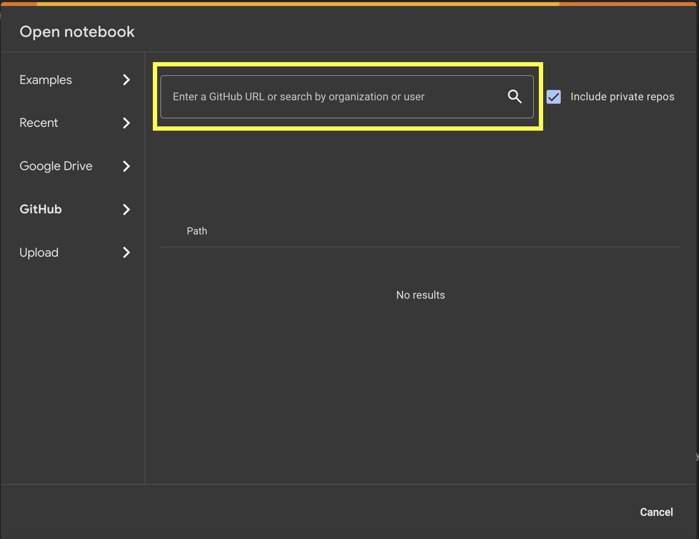

# PhysiCell Training Apps

This repository contains a collection of training apps for PhysiCell. Each app is a self-contained example that demonstrates a specific feature of PhysiCell. The apps are designed to be used in conjunction with the PhysiCell documentation and tutorials.

## Links to Apps

The following links provide access to the apps on Google Colab:

1. [Cell Mechanics](https://colab.research.google.com/drive/1lfXmANTLLQzG76WvSdxhgP41vw8qXWEF?usp=sharing)
2. [Cell Microenviroment](https://colab.research.google.com/drive/1pOd9AOBvrG0brv7qy4rOKuXLB39XsgNX?usp=sharing)
3. [Cell Motility](https://colab.research.google.com/drive/1d-ZBb6NktWwBhu9lidbi-aoN5ceWTJga?usp=sharing)
4. [Cell Secretion](https://colab.research.google.com/drive/15gYkQdlJDikVra2kM1j_CJNFp8VZMh47?usp=sharing)
5. [Cell Volume](https://colab.research.google.com/drive/1nf1RBPx98AaaROBtGJLSr2n6UHZIQi5f?usp=sharing)
6. [Cell Death](https://colab.research.google.com/drive/1EurXPW8dIALmZZkHamtwvQjwB-f8bBAd?usp=sharing)
7. [Cell Cycle](https://colab.research.google.com/drive/1GcmUjMnb-Rg_QE6S388pXPwW9UUflpDP?usp=sharing)

## Slides to understand background and app walkthroughs

### Source Code for Apps

1. [Basic Cell Mechanics](https://github.com/physicell-training/tr_mechanics)
2. [Cell Microenviroment Models](https://github.com/physicell-training/tr_microenvironment)
3. [Cell Motility Models](https://github.com/physicell-training/Motility_Training_App)
4. [Cell Secretion Models](https://github.com/physicell-training/tr_secretion)
5. [Cell Volumes Models](https://github.com/physicell-training/tr_Volume)
6. [Cell Death Models](https://github.com/physicell-training/Death_Models_Training)
7. [Cell Cycle Models](https://github.com/physicell-training/tr_cycle)

You are also welcome to clone each app to your local machine and run it on Colab from your Google Drive.

## Overview of PhysiCell

PhysiCell is a flexible open source framework for building agent-based multicellular models in 3-D tissue environments.

Reference: A Ghaffarizadeh, R Heiland, SH Friedman, SM Mumenthaler, and P Macklin, PhysiCell: an Open Source Physics-Based Cell Simulator for Multicellular Systems, PLoS Comput. Biol. 14(2): e1005991, 2018. DOI: 10.1371/journal.pcbi.1005991

Visit http://MathCancer.org/blog for the latest tutorials and help.

Notable recognition:

- [2019 PLoS Computational Biology Research Prize for Public Impact](https://biologue.plos.org/2019/05/31/announcing-the-winners-of-the-2019-plos-computational-biology-research-prize/)

Study of PhysiCell:

- [Aneequa Sundus, et al. “PhysiCell Training Apps: A Case Study for Creating Interactive Training Materials for Scientific Software Packages.” ](https://doi.org/10.1101/2022.06.24.497566)

- [Heiland, Randy, et al. “PhysiCell Studio: A Graphical Tool to Make Agent-Based Modeling More Accessible.” ](https://doi.org/10.1101/2023.10.24.563727)

- [Ghaffarizadeh, Ahmadreza, et al. “PhysiCell: An Open Source Physics-Based Cell Simulator for 3-D Multicellular Systems.” ](https://doi.org/10.1371/journal.pcbi.1005991)

## Installation

No installation is required. All apps utlitze Google Colab, which is a free cloud-based Jupyter notebook environment. To run an app, you may simply copy the URL of the app and paste it into the Colab notebook URL field, specifically the Github option.

